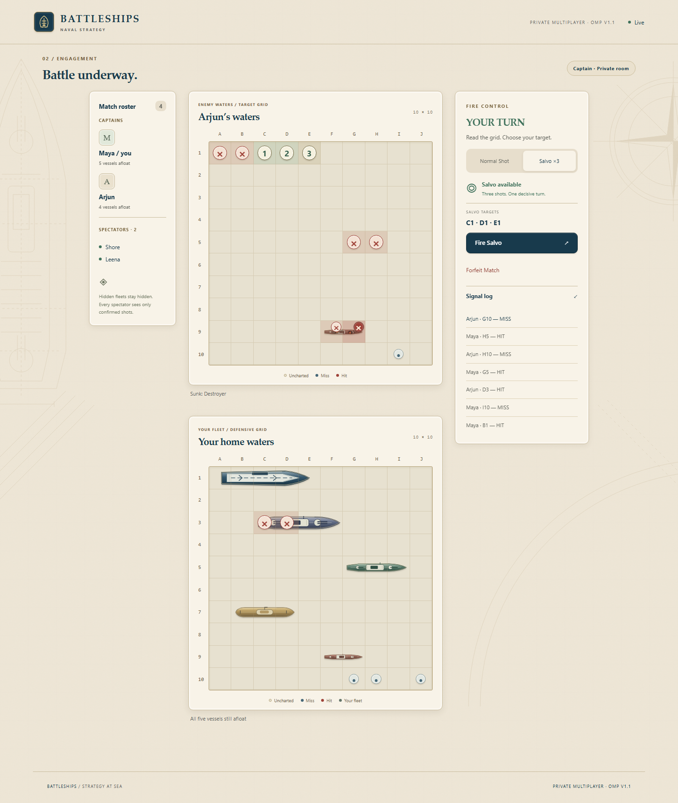

# Battleships OMP

**Battleships OMP v1.1** is private naval strategy for friends: one approved community, four independent 1v1 matches, explicit spectators and 25 admitted players. No administrator is needed once devices are approved.

The v1.1 implementation is complete. Automated validation covers game rules, privacy, concurrent matches, reconnects, browser compatibility and persistence. Physical iPhone background behavior remains a manual verification item; see the handoff for details.



## Run locally

Requires Node.js 22.12+ (Node 24 recommended).

```sh
npm ci
npm run setup
npm run dev
```

Open `http://localhost:8787/join/<INVITE_TOKEN>` using your ignored local `.dev.vars`. Admin: `http://localhost:8787/admin` with its local passphrase. Setup never overwrites existing secrets. Keep localhost/127.0.0.1 consistent because cookies differ. Use separate browser profiles for different players; a new tab in the same profile takes control of that device.

Normal dev builds static assets and starts the real Worker, SQLite Durable Object, sockets and alarms. For frontend hot reload, also run `npm run dev:ui`. Local state stays in `.wrangler/state`. Do not rebuild or restart a server during browser tests.

## Community behavior

The lobby shows online player activity and available battles. Challenge a ready lobby player or select Spectate. Return to the lobby before switching observation or challenging. Each person occupies one view. Four placement/playing matches may coexist; paused matches count, finished results do not. Result cleanup affects only that match and its viewers.

The 25-player capacity includes reconnect reservations. Duplicate tabs consume one place, and reserved captains can return even when full. There is no application limit on stored approved devices in the admin console. Pending requests have a separate limit of 256.

A detected captain disconnect pauses placement or combat for 90 seconds. Returning in time restores the match. Expired setup cancels; expired combat forfeits to a connected opponent or is abandoned without a winner if both are absent. Explicit forfeiting and access revocation remain immediate. Backgrounding alone does not intentionally disconnect. Transport detection and mobile OS suspension still affect when a lost connection is observed.

Approval uses the existing one-year browser cookie. Clearing cookies or using another browser requires approval again. Admin sessions last eight hours. Results clear after 15 seconds or a participant returns sooner. No chat, rankings, AI, public matchmaking or historical match archive.

## Commands and validation

| Command                    | Purpose                                                                                                             |
| -------------------------- | ------------------------------------------------------------------------------------------------------------------- |
| `npm run typecheck`        | Shared/client/server/test TypeScript checks                                                                         |
| `npm test`                 | Rules, privacy, concurrent matches, reconnects and admission                                                        |
| `npm run test:e2e`         | Real Worker: desktop/phone Chromium, desktop Firefox, phone WebKit                                                  |
| `npm run test:persistence` | Approval, identity, admin session and revocation across restarts                                                    |
| `npm run test:runtime`     | Legacy SQL upgrade, 300 approvals, 25 places, four matches, wire isolation, real 90-second alarm and match recovery |
| `npm run build`            | Production frontend                                                                                                 |
| `npm run check`            | Typecheck, unit tests, build, browser, persistence and runtime suites                                               |
| `npm run format:check`     | Source/document formatting                                                                                          |
| `npm run deploy:check`     | Build and deployment dry-run; does not publish                                                                      |

Install browser binaries once with `npx playwright install chromium firefox webkit`. Tests use local-only public credentials and separate storage. **Never deploy either test configuration or the legacy fixture.** Runtime tests wait for a real 90-second timeout. Browser screenshots/traces go to ignored `test-results/`. Isolated runtime state lives under ignored `.wrangler/`.

## Architecture and compatibility

The Worker still routes to `ROOM.getByName('private-community-v1')`. The existing `BattleshipsRoom` coordinates this bounded community. Its engine maintains independent matches, serializes per-viewer public snapshots, and commits cloned state synchronously before broadcasting. Broadcast suppression avoids unrelated match updates. Hibernating sockets retain identity attachments; alarms resolve deadlines.

Storage schema version 2 converts legacy room JSON in place on first access and keeps its original value in room row 2. Approval hashes, cookie names, admin session table, Worker name, DO class/binding and migration tag remain unchanged. A code-only rollback to v1 is unsafe after conversion; see the handoff. Public sunk-ship geometry remains derived on read and never changes stored shots.

The browser title and UI version are v1.1. The service remains `battleships-omp-v1` so the existing URL and community persist. This build does not deploy anything. Review locally and deploy only after an explicit decision, between matches. Do not casually rename the Worker or replace its namespace. Existing invitation/admin secrets remain valid and must never enter client code or logs.

See [SPEC.md](SPEC.md) for acceptance requirements and [PROJECT_HANDOFF.md](PROJECT_HANDOFF.md) for validation and rollout notes. Historical design references remain under `design-review/`.
